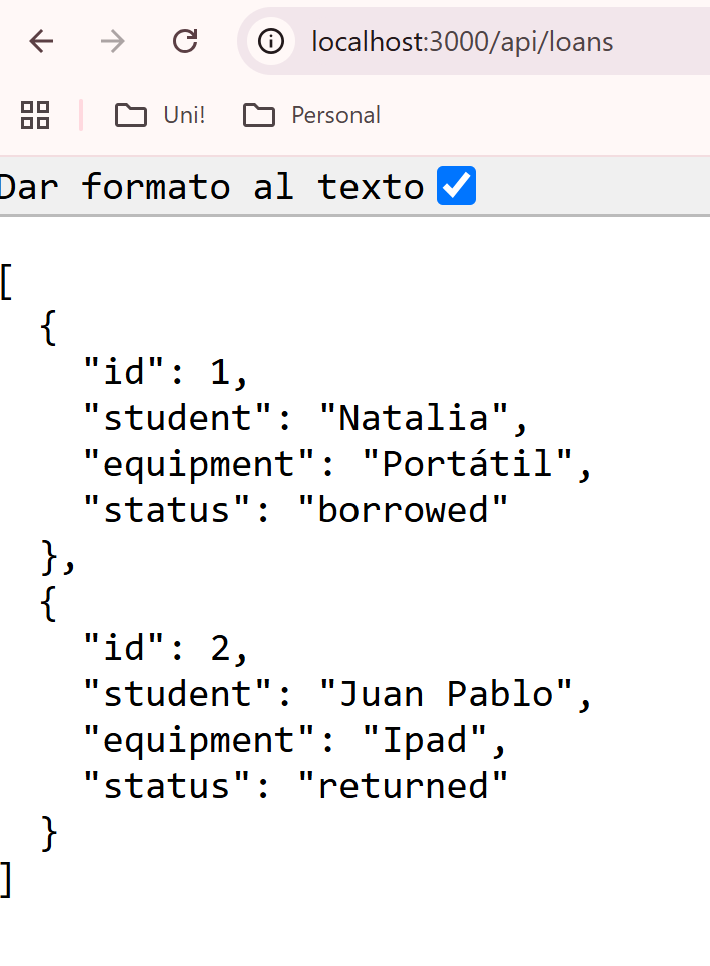
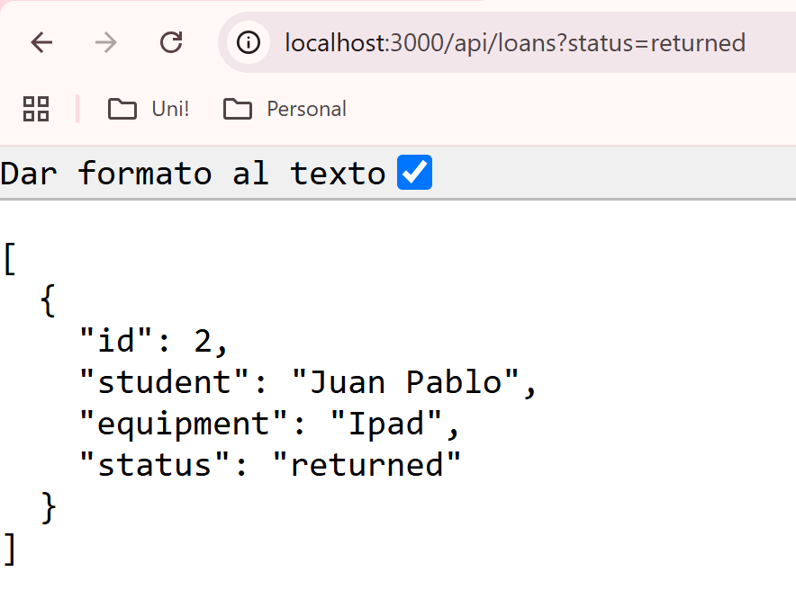
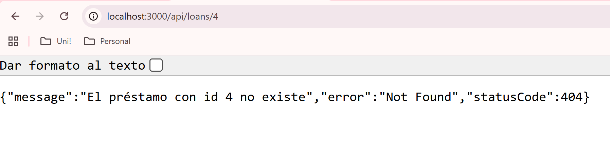
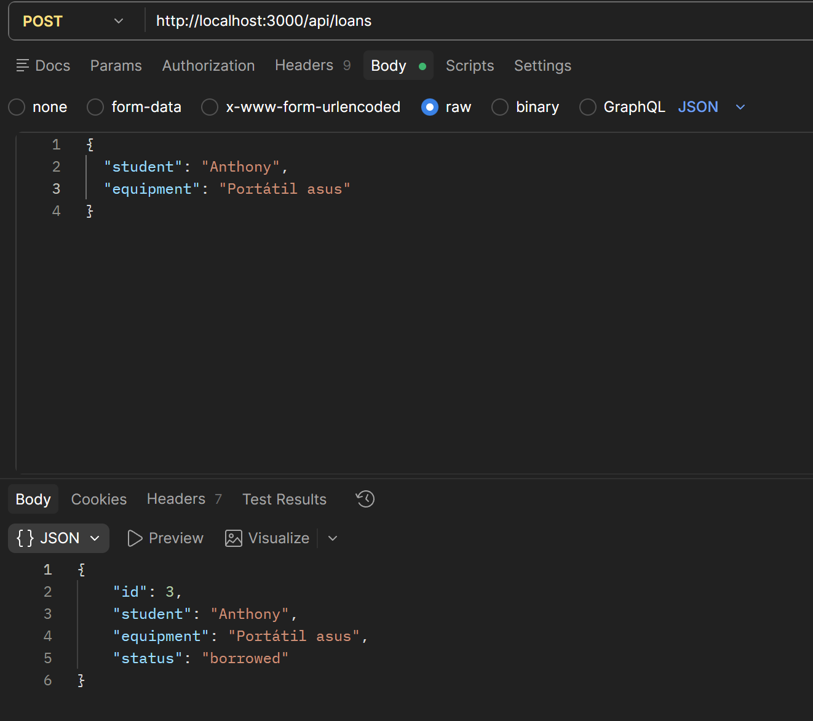
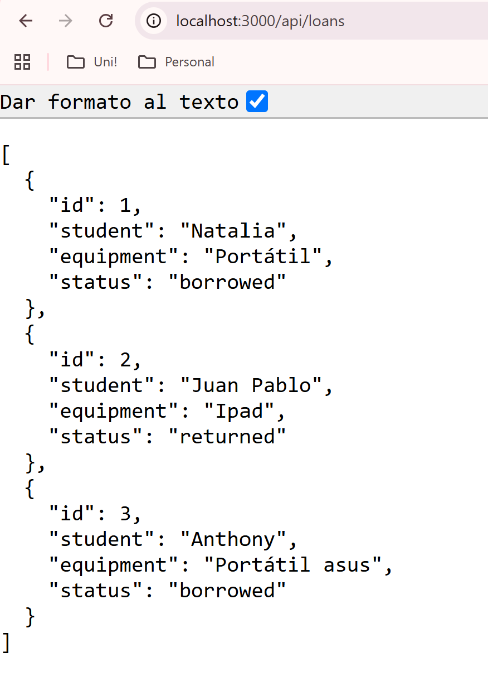
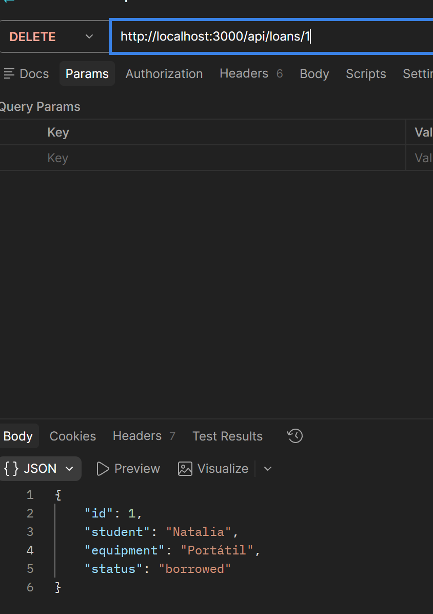
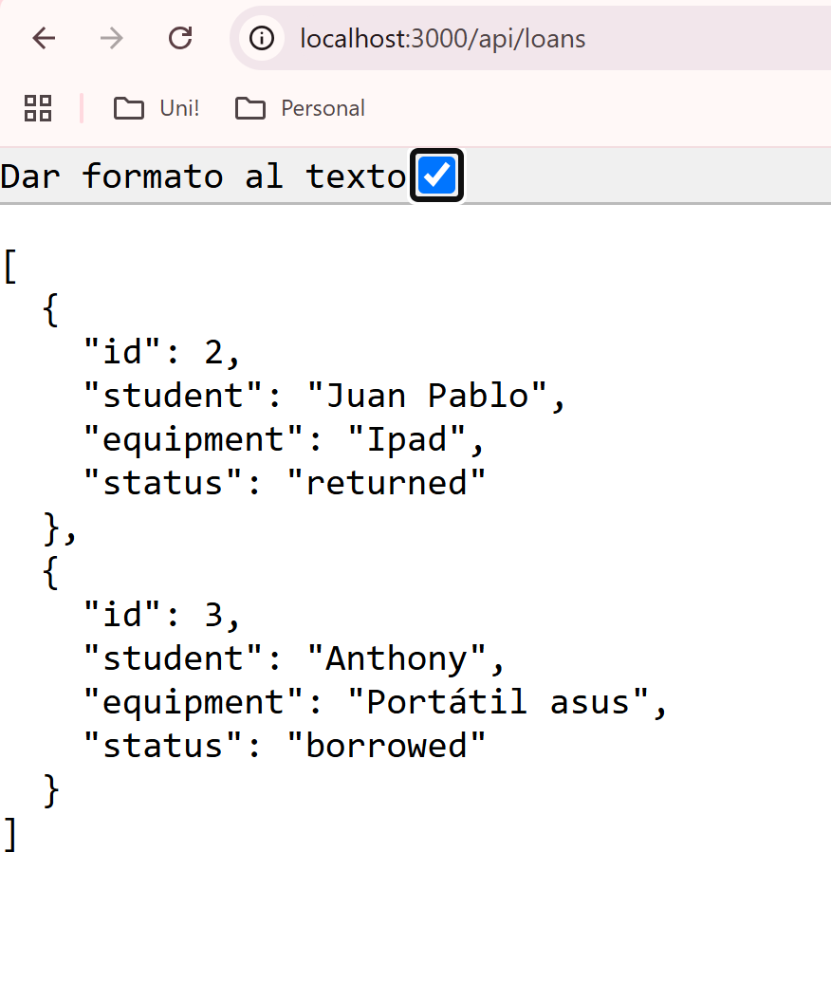
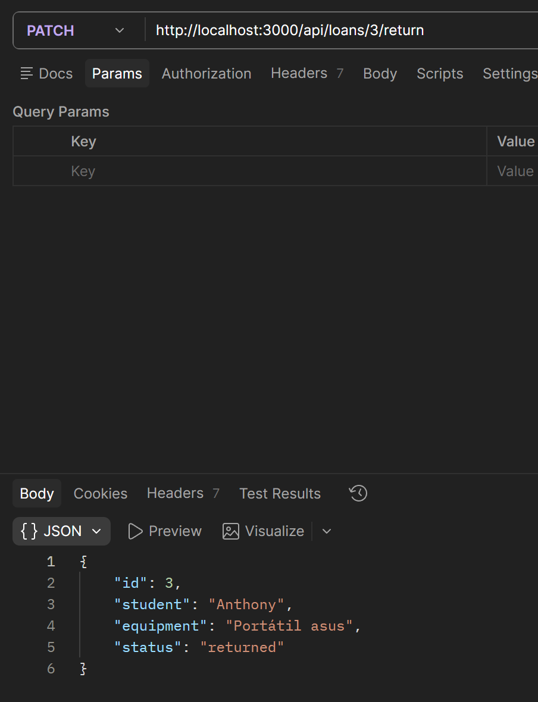
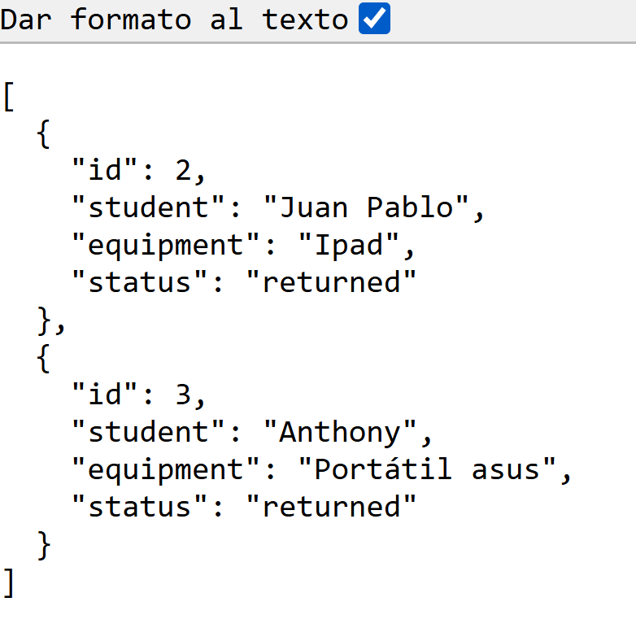

## Funcionalidad!

Se implementaron las siguientes rutas:

| Método | Ruta | Descripción |
|--------|------|-------------|
| GET | `/api/loans` | Consulta todos los préstamos |
| GET | `/api/loans?status=borrowed` | Filtra los préstamos por estado |
| DELETE | `/api/loans/:id` | Elimina un préstamo por id |
| POST | `/api/loans` | Crea un nuevo préstamo |

También se implementó de manera opcional :3 :

| Método | Ruta | Descripción |
|--------|------|-------------|
| PATCH | `/api/loans/:id/return` | Cambia un préstamo de `borrowed` a `returned` |

## Estructura (。_。)

La funcionalidad `loans` está dividida en:

- `LoansModule`: registra el controller y el service
- `LoansController`: recibe e interpreta las peticiones HTTP
- `LoansService`: contiene los datos y las operaciones sobre los loans
- `Loan`: define la estructura de un loan
- `CreateLoanDTO`: define los datos que debe enviar el cliente al crear un loan

## Recorrido de una petición

Cuando llega una petición, el `LoansController` la recibe mediante una ruta y obtiene la información necesaria usando decoradores como `@Query()`, `@Param()` o `@Body()`

Luego, el controller llama al método correspondiente de `LoansService`

El service realiza la operación sobre el arreglo de loans y devuelve el resultado al controller. NestJS envía esa información como respuesta al cliente

## Inyección de LoansService :D

Tres piezas para para inyectar LoansService:

1. Marcar el service con `@Injectable()`

2. Registrar `LoansService` dentro de `providers` en `LoansModule`

3. Inyectar `LoansService` mediante el constructor de `LoansController`

## Persistencia de los datos..

Los loans se almacenan en un arreglo dentro de `LoansService`, por lo que existen únicamente en memoria mientras la aplicación está ejecutándose

Al reiniciar la aplicación, el arreglo vuelve a crearse con los préstamos definidos inicialmente (en el loan service). Es por esto que los préstamos creados o eliminados durante la ejecución anterior desaparecen

## Evidencias ^.^

### Consultar préstamos

### Filtrar préstamos por estado

### id inexistente

### Crear préstamo

### Eliminar préstamo

### Cambio de estado 

